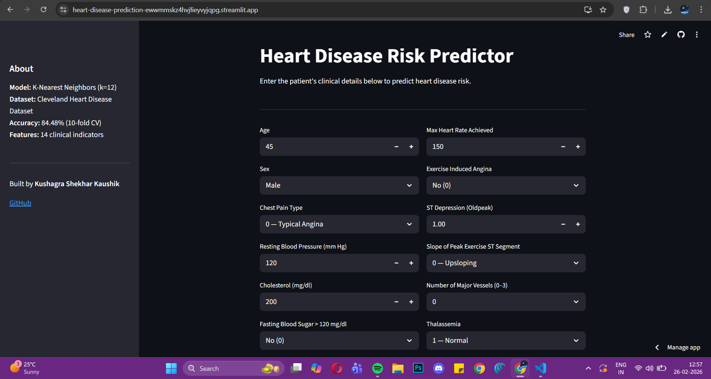
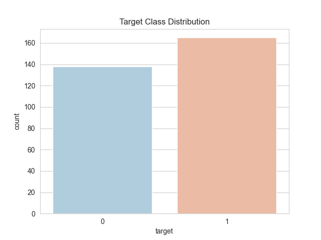
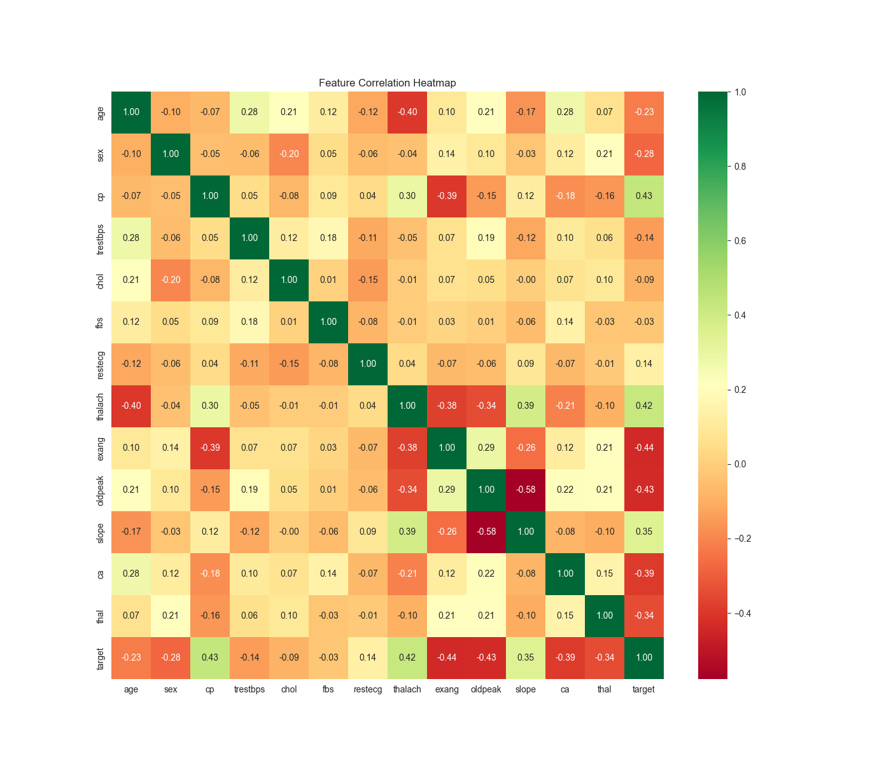
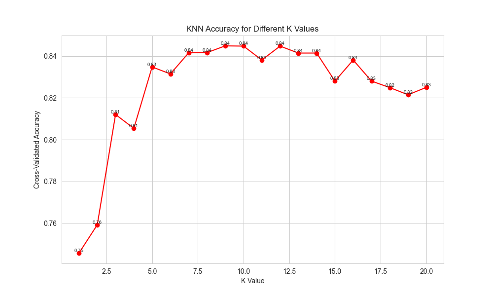

# Heart Disease Prediction

Tried to figure out if we can predict heart disease from basic clinical data. Short answer : yes, reasonably well. Used the Cleveland Heart Disease dataset, tested a couple of ML approaches, and then wrapped the best model in a Streamlit web app so anyone can actually use it.

 **[Live Demo → heart-disease-prediction-ewwmmskz4hvjfieyvyjqpg.streamlit.app](https://heart-disease-prediction-ewwmmskz4hvjfieyvyjqpg.streamlit.app/)**

---

## What this is

Enter 13 clinical features : age, cholesterol, chest pain type, max heart rate, etc. and the app instantly tells you whether the patient is at high or low risk of heart disease, along with a confidence score.

The model running under the hood is KNN (k=12), trained on the Cleveland Heart Disease dataset and evaluated using 10-fold cross-validation. Not a black-box deep learning model every prediction is explainable.

---

## Demo



> **[→ Open Live App](https://heart-disease-prediction-ewwmmskz4hvjfieyvyjqpg.streamlit.app/)**

---

## Dataset

Cleveland Heart Disease Dataset : 303 patients, 14 clinical features.

| Feature | Description |
|--------|-------------|
| age | Age in years |
| sex | 1 = male, 0 = female |
| cp | Chest pain type (0–3) |
| trestbps | Resting blood pressure (mm Hg) |
| chol | Serum cholesterol (mg/dl) |
| fbs | Fasting blood sugar > 120 mg/dl |
| restecg | Resting ECG results |
| thalach | Maximum heart rate achieved |
| exang | Exercise induced angina |
| oldpeak | ST depression induced by exercise |
| slope | Slope of peak exercise ST segment |
| ca | Number of major vessels (0–3) |
| thal | Thalassemia type |
| **target** | **1 = disease, 0 = no disease** |

Download: [heart.csv](dataset/heart.csv)

---

## Project Structure

```
heart-disease-prediction/
│
├── dataset/
│   └── heart.csv
├── notebook/
│   └── heart_disease_prediction.ipynb
├── images/
│   ├── app_screenshot.png
│   ├── target_distribution.png
│   ├── correlation_heatmap.png
│   └── knn_accuracy.png
├── app.py
├── requirements.txt
└── README.md
```

---

## What I did

**1. Explored the data**
Checked class balance first : roughly 54% positive (disease) vs 46% negative (no disease), so no major imbalance issue.

**2. Feature correlation**
Ran a heatmap to see what actually correlates with the target. `thalach` (max heart rate) and `cp` (chest pain type) came out as the strongest positive indicators. `exang` and `oldpeak` were negatively correlated higher values meant lower disease likelihood.

**3. Preprocessing**
- One-hot encoded all categorical features (`sex`, `cp`, `fbs`, `restecg`, `exang`, `slope`, `ca`, `thal`)
- StandardScaler on continuous features: `age`, `trestbps`, `chol`, `thalach`, `oldpeak`

**4. Model training**
Tested KNN for k = 1 to 20 using 10-fold cross-validation. k=12 gave the best result. Ran Random Forest as a comparison.

**5. Deployment**
Wrapped the trained KNN model in a Streamlit web app. Users input patient data through dropdowns and number fields, model predicts in real time with a confidence percentage. Deployed on Streamlit Cloud.

---

## Results

| Model | CV Accuracy |
|-------|------------|
| KNN (k=12) | **84.48%** |
| Random Forest | 81.14% |

KNN edged out Random Forest likely because the dataset is small (303 samples) and the feature space after one-hot encoding isn't huge, so a distance-based model does fine.

---

## Visualizations

**Target Distribution**



**Correlation Heatmap**



**KNN Accuracy vs K Value**



---

## How to run locally

```bash
git clone https://github.com/kushagrakaush1k/heart-disease-prediction
cd heart-disease-prediction
pip install -r requirements.txt
streamlit run app.py
```

App opens at `localhost:8501`

---

## Requirements

```
pandas
numpy
matplotlib
seaborn
scikit-learn
streamlit
jupyter
```

---

## Takeaways

- Max heart rate (`thalach`) being a strong predictor makes clinical sense the heart's response to stress is a direct indicator of cardiovascular health
- KNN worked better than Random Forest here likely due to small data size
- Cross-validation was important a simple train/test split would've been too noisy on 303 samples
- Wrapping it in Streamlit added real-world usability, something you can hand to a non-technical person and they can use it

---

## References

- [Original article by Aman Kharwal](https://amanxai.com/2020/05/20/heart-disease-prediction-with-machine-learning/)
- [UCI Heart Disease Dataset](https://archive.ics.uci.edu/ml/datasets/heart+disease)
